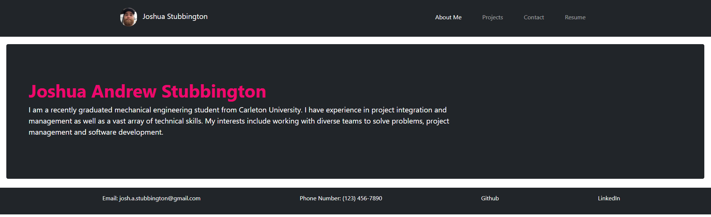

# react_portfolio

This is my first draft of a portfolio website that utilizes React fundamentals to create a basic portfolio with the following pages:

1. About Me Section
2. Projects
3. Contact Form
4. Resume

This application can be iterated upon to improve my career development materials and by extension my ability to network.

